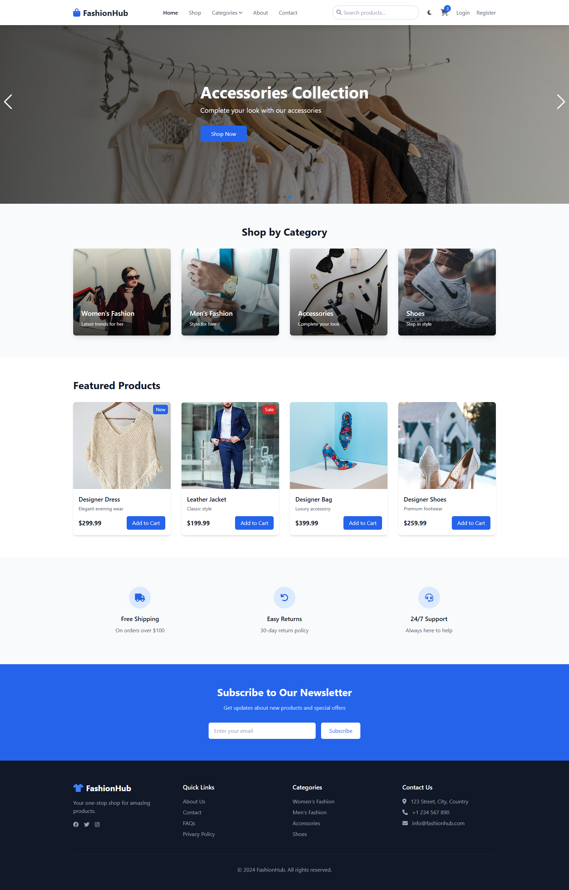
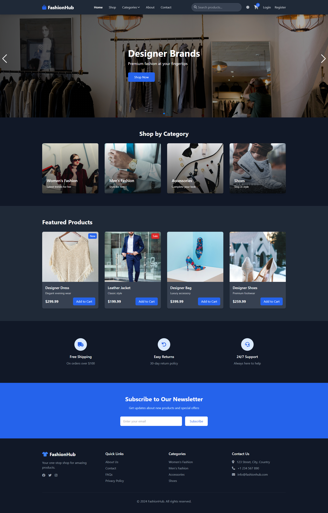
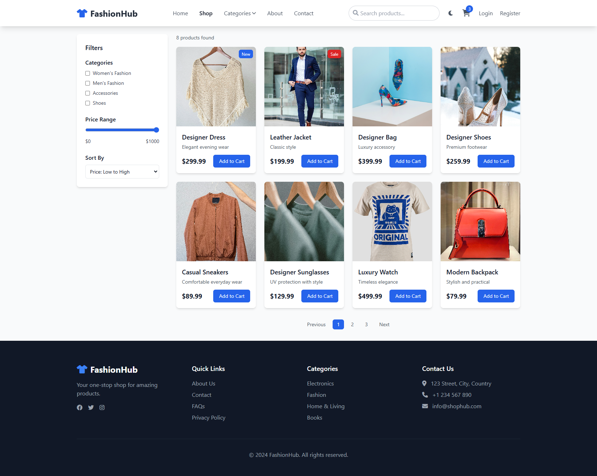
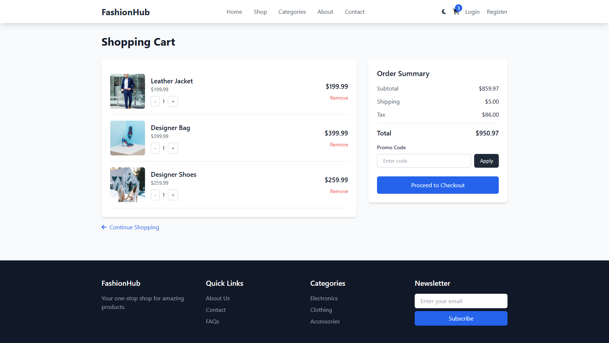
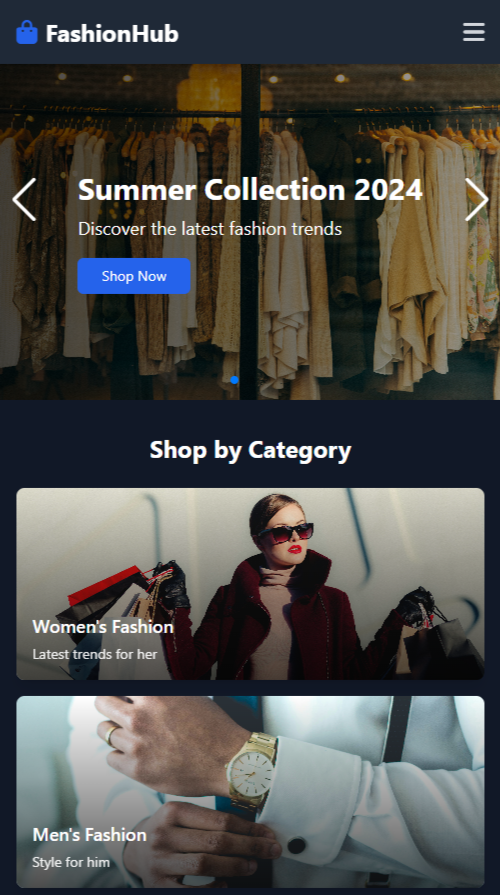
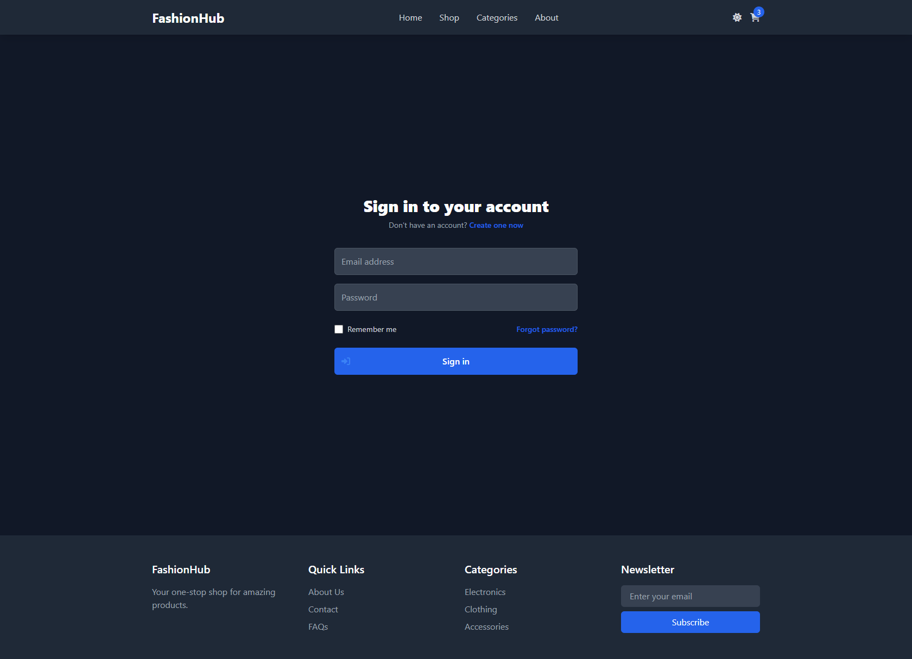

# FashionHub 🛍️

<div align="center">
  
  
  <p align="center">
    A modern, responsive e-commerce platform with dark/light mode support
    <br />
    <a href="#screenshots">View Screenshots</a>
    ·
    <a href="#features">Features</a>
    ·
    <a href="#installation">Installation</a>
  </p>
</div>

## 📸 Screenshots

<div align="center">
  <!-- Light/Dark Mode Comparison -->
  
  
  <p align="center"><em>Homepage - Light/Dark Mode</em></p>
</div>

<details>
<summary>📱 View More Screenshots</summary>

<div align="center" style="display: grid; grid-template-columns: repeat(2, 1fr); gap: 10px; margin: 20px 0;">
  <a href="screenshots/shop.png" target="_blank">
    
  </a>
  <a href="screenshots/cart.png" target="_blank">
    
  </a>
  <a href="screenshots/mobile.png" target="_blank">
    
  </a>
  <a href="screenshots/login.png" target="_blank">
    
  </a>
</div>
</details>

## ✨ Key Features

- 🎨 Modern UI with Dark/Light mode
- 📱 Fully responsive design
- 🛒 Complete shopping experience
- 👤 User authentication & profiles
- 🔒 Secure checkout process

## 🚀 Quick Start

1. Clone and install:
```bash
git clone https://github.com/lakmina456/FashionHub_e_commerce_website
cd fashionhub
npm install
```

2. Start development server:
```bash
npm run dev
```

## 🛠️ Tech Stack

- Frontend: HTML5, Tailwind CSS, JavaScript
- Backend: Node.js, Express.js, MongoDB
- Authentication: JWT

## 📝 License

MIT License - feel free to use and modify!