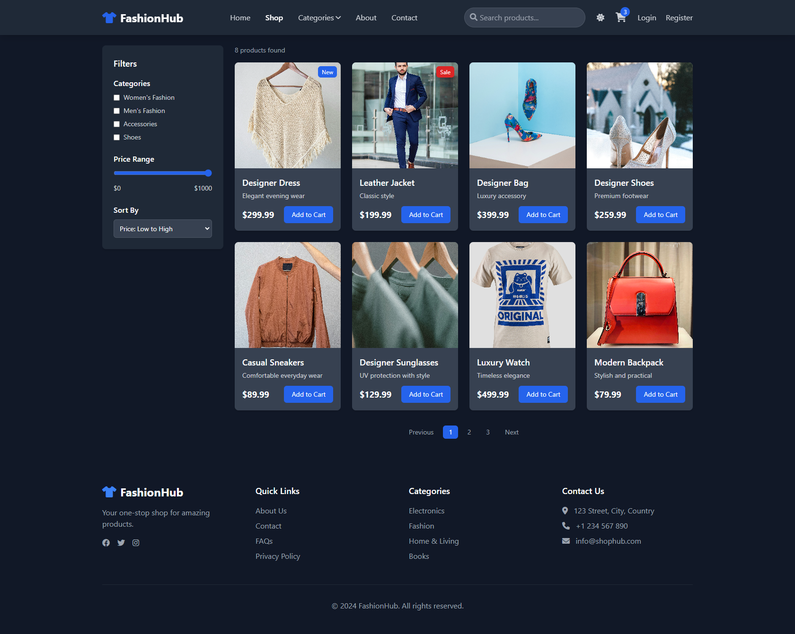
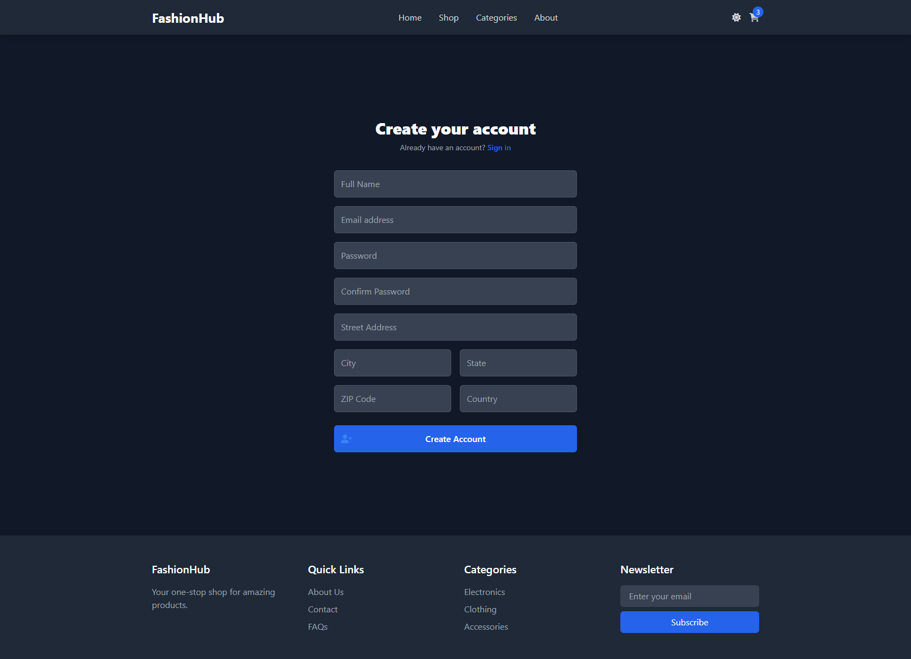
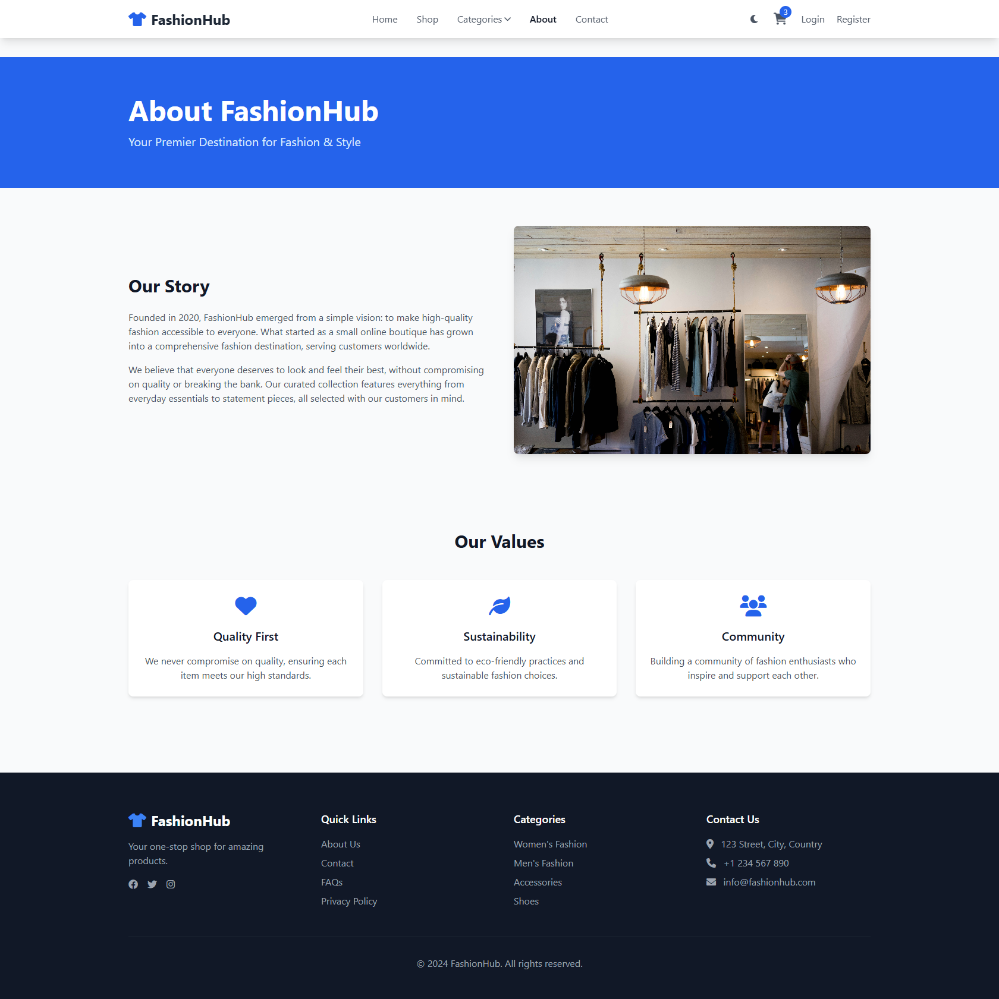
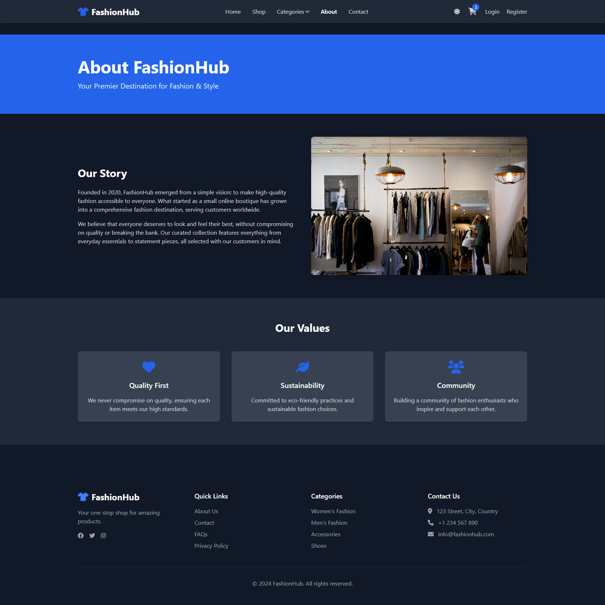
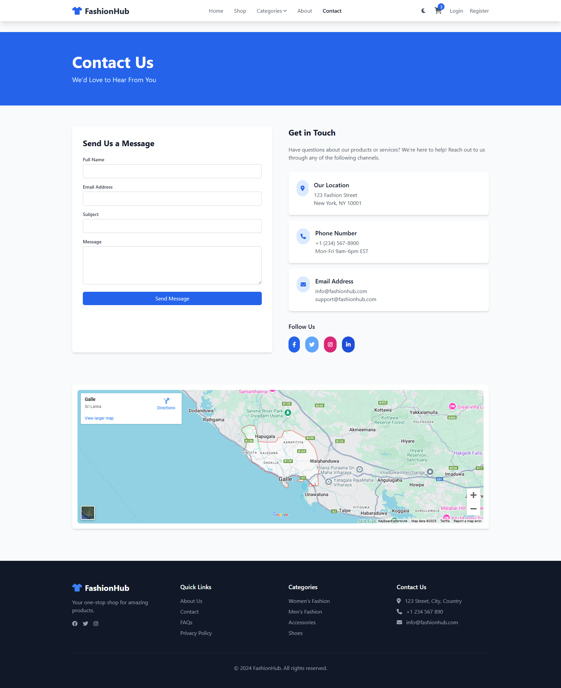
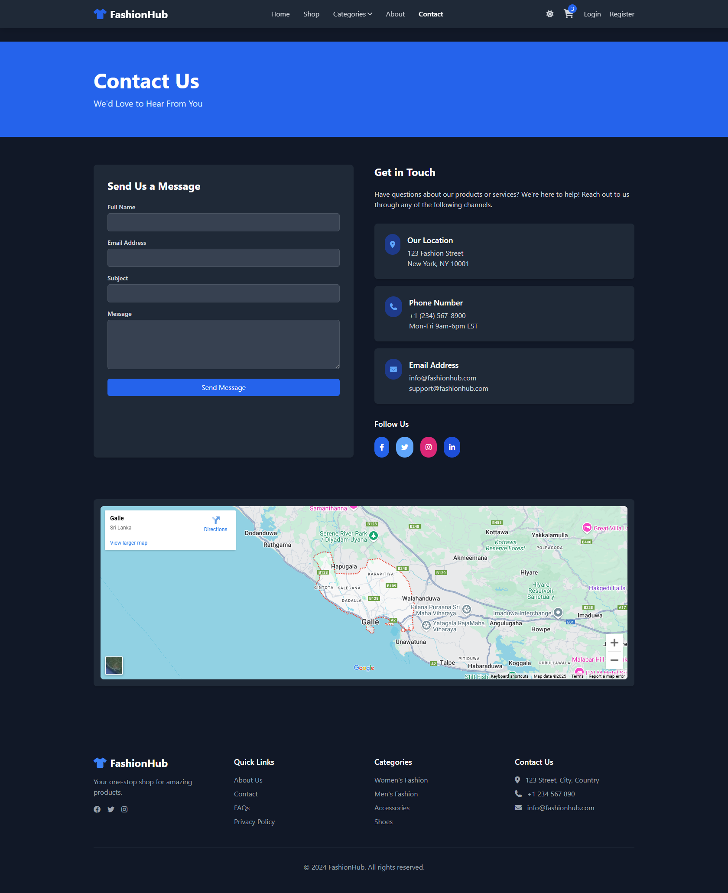
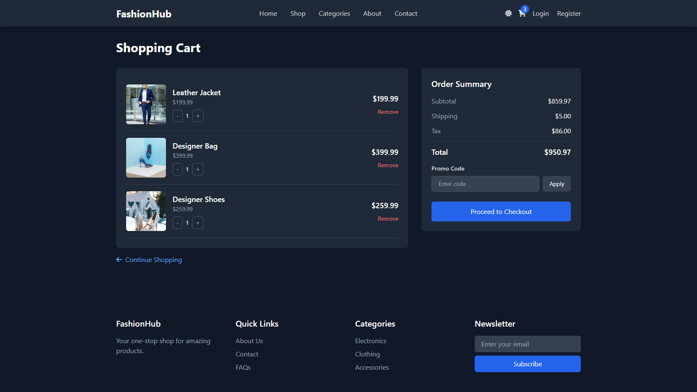

# FashionHub 🛍️

<div align="center">
  
  
  <p align="center">
    A modern, responsive e-commerce platform built with cutting-edge web technologies
    <br />
    <a href="#demo">View Demo</a>
    ·
    <a href="#features">Features</a>
    ·
    <a href="#installation">Installation</a>
  </p>
</div>

## 🌟 Overview

FashionHub is a sleek and modern e-commerce platform that offers a seamless shopping experience. Built with a focus on user experience and performance, it features a responsive design that works beautifully across all devices.
## 📸 Screenshots

### 🌞 Light Mode
<div align="center">
  
  <p align="center"><em>Homepage - Light Theme</em></p>
  
  
  <p align="center"><em>Shop Page - Light Theme</em></p>
</div>

### 🌙 Dark Mode
<div align="center">
  
  <p align="center"><em>Homepage - Dark Theme</em></p>
  
  
  <p align="center"><em>Shop Page - Dark Theme</em></p>
</div>

### 📱 Mobile View
<div align="center">
  
  <p align="center"><em>Responsive Mobile Design</em></p>
</div>

### 🖼️ Other Screenshots
<details>
<summary>🖼️ View More Screenshots</summary>

### Authentication Pages
<div align="center">
  <a href="screenshots/login.png" target="_blank">
    
  </a>
  <a href="screenshots/register.png" target="_blank">
    
  </a>
  <p align="center"><em>Login and Registration Pages</em></p>
</div>

### About & Contact
<div align="center">
  <details>
    <summary>📝 About Page (Light/Dark)</summary>
    
    <p align="center"><em>About Page - Light Theme</em></p>
    
    <p align="center"><em>About Page - Dark Theme</em></p>
  </details>

  <details>
    <summary>📞 Contact Page (Light/Dark)</summary>
    
    <p align="center"><em>Contact Page - Light Theme</em></p>
    
    <p align="center"><em>Contact Page - Dark Theme</em></p>
  </details>
</div>

### Shopping Cart
<div align="center">
  <details>
    <summary>🛒 Cart Page (Light/Dark)</summary>
    
    <p align="center"><em>Cart Page - Light Theme</em></p>
    
    <p align="center"><em>Cart Page - Dark Theme</em></p>
  </details>
</div>

</details>

## ✨ Features

- 🎨 **Modern UI/UX**
  - Responsive design using Tailwind CSS
  - Dark/Light mode support
  - Smooth animations and transitions
  - Mobile-first approach

- 🛒 **Shopping Experience**
  - Product catalog with filtering and sorting
  - Shopping cart functionality
  - Wishlist management
  - Secure checkout process

- 👤 **User Management**
  - User authentication and authorization
  - Profile management
  - Order history
  - Address management

- 🔒 **Security**
  - JWT-based authentication
  - Secure password handling
  - Protected API endpoints

## 🛠️ Built With

- Frontend:
  - HTML5
  - Tailwind CSS
  - JavaScript (ES6+)
  - Font Awesome Icons

- Backend:
  - Node.js
  - Express.js
  - MongoDB
  - JWT Authentication

## 🚀 Getting Started

### Prerequisites

- Node.js (v14 or higher)
- MongoDB
- npm or yarn

### Installation

1. Clone the repository
```bash
git clone https://github.com/lakmina456/FashionHub_e_commerce_website
cd fashionhub
```

2. Install dependencies
```bash
npm install
```

3. Set up environment variables
```bash
cp .env.example .env
# Edit .env with your configuration
```

4. Start the development server
```bash
npm run dev
```

## 🌐 API Endpoints

### Products
```
GET    /api/products         # Get all products
GET    /api/products/:id     # Get single product
POST   /api/products         # Create product (Admin)
PATCH  /api/products/:id     # Update product (Admin)
DELETE /api/products/:id     # Delete product (Admin)
```

### Users
```
POST   /api/users/register   # Register new user
POST   /api/users/login      # Login user
GET    /api/users/profile    # Get user profile
PATCH  /api/users/profile    # Update user profile
```

### Orders
```
POST   /api/orders           # Create new order
GET    /api/orders           # Get user's orders
GET    /api/orders/:id       # Get single order
PATCH  /api/orders/:id       # Update order status
```

## 📱 Mobile Responsiveness

FashionHub is designed to work seamlessly across all devices:
- 📱 Mobile phones
- 📱 Tablets
- 💻 Laptops
- 🖥️ Desktop computers

## 🎯 Future Enhancements

- [ ] Integration with multiple payment gateways
- [ ] Real-time order tracking
- [ ] Product reviews and ratings
- [ ] Social media authentication
- [ ] Advanced search with filters
- [ ] Email notifications

## 🤝 Contributing

1. Fork the repository
2. Create your feature branch (`git checkout -b feature/AmazingFeature`)
3. Commit your changes (`git commit -m 'Add some AmazingFeature'`)
4. Push to the branch (`git push origin feature/AmazingFeature`)
5. Open a Pull Request

## 📄 License

This project is licensed under the MIT License - see the [LICENSE](LICENSE) file for details.

## 📧 Contact

Isuru Lakmina - [@isuru_lakmina](https://twitter.com/isuru_lakmina)

Project Link: [https://github.com/lakmina456/FashionHub_e_commerce_website]

## 🙏 Acknowledgments

- [Tailwind CSS](https://tailwindcss.com)
- [Font Awesome](https://fontawesome.com)
- [Unsplash](https://unsplash.com) - for product images 